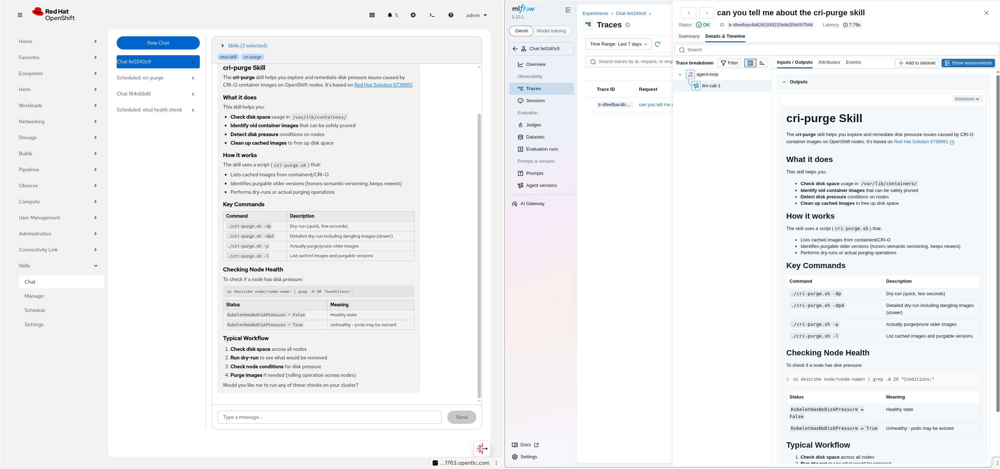

# Openshift Skills Plugin

An OpenShift Console Plugin that manages SKILLS as Kubernetes Jobs.

- recently added OpenShift multi-tenancy support for users (see [CLAUDE.md]CLAUDE.md for details).

  

To install as a cluster-admin

```bash
helm upgrade --install skills-plugin chart/ -n skills-plugin --create-namespace
```

  

For MLFlow (disabled by default) support

```bash
COOKIE=$(openssl rand -base64 32)
helm upgrade --install skills-plugin chart/ -n skills-plugin --create-namespace --set mlflow.enabled=true --set mlflow.oauth.cookieSecret=$COOKIE
```

## Simple Demo

1. Deploy the helm chart

1. `Skills Settings` > Create a Model as a Service (MaaS) endpoint and test it works. This uses RHOAI3 MaaS - https://maas.apps.example.com/maas-api. Single model "/v1" endpoints are also supported if you don't have MaaS.

    

1. `Skills Manager` > Upload the [ETCD_SKILL.md](demo/ETCD_SKILL.md)

    

1. `Skills Schedule` > Schedule the skill to run. Create the rbac for the service account that will run your Job `oc apply -f demo/etcd-skill-rbac.yaml`. I have been lazy here and given it cluster-admin ! You will want to give it least privilege of course. Choose an image that has `oc` binary (and any other tools your skill may need). Set the `prompt` to run the parts of the skill you need.

    

1. Once the Job has run, the output can be seen in the `Skills Chat` as well as the scheduled skills screen. In this example we updated the prompt to defrag etcd based on the skill recommendation.

    

    

1. MLFlow (optional) support for tracing and observability.

    
